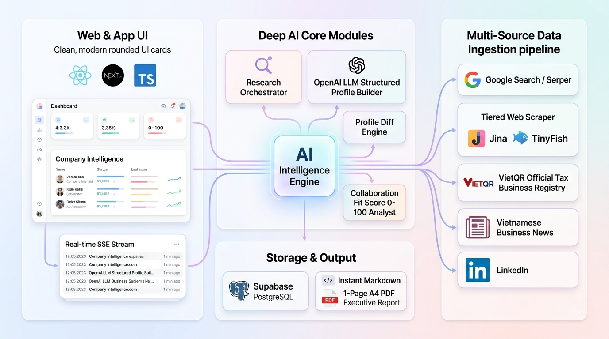
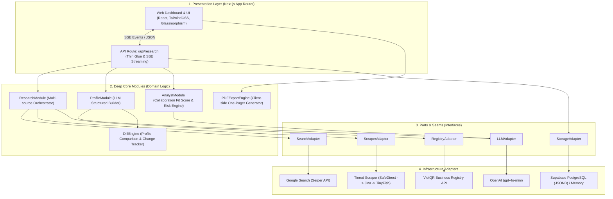
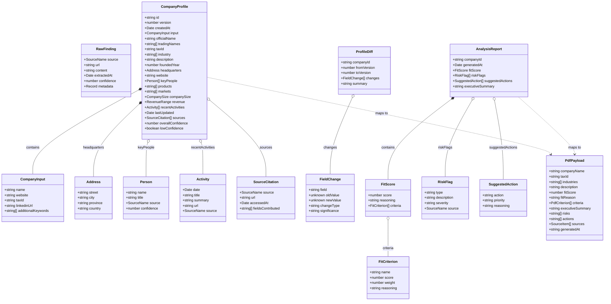
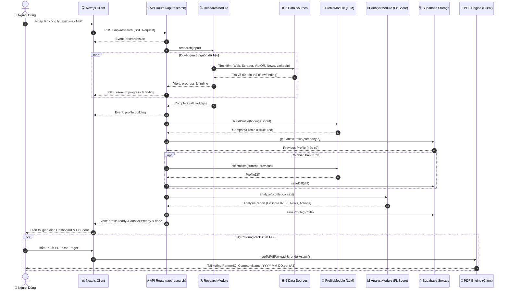

# PartnerIQ (TechBridgeAI) 🚀

> **AI-Powered Corporate Intelligence & Collaboration Intelligence Platform**  
> Nền tảng thẩm định doanh nghiệp thông minh tự động: Thu thập dữ liệu đa nguồn độc lập, tổng hợp hồ sơ chuẩn hóa qua LLM, đánh giá điểm phù hợp hợp tác (Collaboration Fit Score), theo dõi biến động lịch sử (Diff Engine) và xuất báo cáo One-Pager PDF chuyên nghiệp.

[](https://github.com/devonxjz/TechBridgeAI/actions/workflows/ci.yml)
[](https://vitest.dev/)
[-black?logo=next.js)](https://nextjs.org/)
[](https://www.typescriptlang.org/)
[](https://openai.com/)
[](https://supabase.com)
[](https://opensource.org/licenses/MIT)

---

## 🖼️ Tổng Quan Kiến Trúc Hệ Thống (System Overview)

<div align="center">
  
  <p><em>Hình 1: Kiến trúc tổng thể hệ sinh thái PartnerIQ (TechBridgeAI) — Tương tác đa nguồn, xử lý lõi AI, lưu trữ đa phiên bản và xuất bản tài liệu.</em></p>
</div>

---

## 🌟 Tính Năng Nổi Bật

* 🌐 **Multi-source Research Pipeline (Thu thập đa nguồn thời gian thực):**
  * 🔍 **Web Search:** Tích hợp Serper Google Search API và chỉ tổng hợp dữ liệu trả về từ nguồn thật.
  * 🛡️ **Tiered Website Scraper (3 cấp độ tự phục hồi):** Chuỗi fallback `SafeDirect → Jina Reader → TinyFish` với cơ chế chống SSRF (Private IP/Localhost block), DNS Pinning, giới hạn luồng 1MB và bộ lọc HTML tuyến tính an toàn.
  * 🏛️ **VietQR Official Business Registry:** Tra cứu trực tiếp thông tin doanh nghiệp qua Mã số thuế (MST) với in-memory caching (7 ngày), tự động fallback sang Aggregator Search khi API nghẽn.
  * 📰 **Tin tức kinh doanh Việt Nam:** Tự động tìm kiếm các bài viết từ CafeF, Báo Đầu tư, VnExpress, Vietstock...
  * 💼 **Bóc tách LinkedIn / Nhân sự:** Thu thập thông tin ban lãnh đạo và đội ngũ cốt cán.
* ⚡ **Real-time SSE Streaming:** Trực quan hóa tiến trình thu thập và phân tích dữ liệu dạng timeline sự kiện thời gian thực (Server-Sent Events).
* 🧠 **OpenAI Structured Profile Builder:** Chuẩn hóa thông tin tự động bằng Zod Schema & Structured Outputs (Strict Mode), tính toán độ tin cậy (`overallConfidence`) theo trọng số từng nguồn.
* 📊 **Analyst Module & Collaboration Fit Score (0–100):** Đánh giá mức độ phù hợp hợp tác kinh doanh theo 5 tiêu chí chuẩn hóa:
  * 🏢 **Phù hợp ngành (Industry Alignment - 30%)**
  * 👥 **Tương thích quy mô (Company Size Match - 20%)**
  * 📍 **Phù hợp địa lý (Geographic Relevance - 15%)**
  * 💻 **Trưởng thành số (Digital Maturity - 15%)**
  * 📈 **Hoạt động gần đây (Recent Activity - 20%)**
* 🔍 **"What Changed?" Diff Engine:** So sánh tự động giữa các phiên bản hồ sơ của một doanh nghiệp (v1 → v2), nhận diện biến động về nhân sự, địa chỉ, ngành nghề và quy mô.
* 🗄️ **Multi-Version Storage (Supabase PostgreSQL):** Lưu trữ lịch sử hồ sơ dạng JSONB, tối ưu hóa truy vấn và bảo toàn toàn bộ vết thay đổi.
* 📑 **Bộ Công Cụ Xuất Bản Báo Cáo Chuyên Nghiệp:**
  * 📋 **Markdown & JSON Export:** Sao chép vào Clipboard hoặc tải file `.md` / `.json` ngay tức thì.
  * 📄 **Client-side PDF One-Pager (A4 Portrait):** Tạo báo cáo 1 trang tóm tắt chuẩn doanh nghiệp tiếng Việt có dấu với `@react-pdf/renderer` qua Dynamic Import (Zero Server Overhead, tải font Noto Sans cục bộ, hoạt động offline).

---

## 🏛️ Lược Đồ Kiến Trúc & Class Diagram

### 1. Kiến Trúc Phân Lớp (Hexagonal / Ports & Adapters Architecture)

Hệ thống tuân thủ nghiêm ngặt nguyên lý **Ports & Adapters**, tách biệt hoàn toàn giữa logic nghiệp vụ lõi (Deep Core Modules) và các dịch vụ bên ngoài (Infrastructure Adapters):



---

### 2. Lược Đồ Class - Domain Entities & Models (Class Diagram 1)

Lược đồ mô tả toàn bộ cấu trúc dữ liệu miền (Domain Models) được định kiểu chặt chẽ trong hệ thống:



---

### 3. Lược Đồ Class - Deep Modules & Infrastructure Ports/Adapters (Class Diagram 2)

Lược đồ mô tả các Interface (Ports), các Deep Modules và các Concrete Adapters thực thi:

```mermaid
classDiagram
  direction TB

  %% Ports (Interfaces)
  class LLMAdapter {
    <<interface>>
    +complete(prompt: string, options?: LLMOptions) Promise~string~
    +completeStructured~T~(prompt: string, schema: ZodSchema~T~, options?: LLMOptions) Promise~T~
    +stream(prompt: string, options?: LLMOptions) AsyncGenerator~string~
  }

  class SearchAdapter {
    <<interface>>
    +search(query: string, options?: SearchOptions) Promise~SearchResult[]~
  }

  class ScraperAdapter {
    <<interface>>
    +extract(url: string) Promise~ScrapedContent~
  }

  class RegistryAdapter {
    <<interface>>
    +findByTaxId(taxId: string) Promise~RegistryRecord | null~
  }

  class StorageAdapter {
    <<interface>>
    +saveProfile(profile: CompanyProfile) Promise~void~
    +getProfile(companyId: string, version?: number) Promise~CompanyProfile | null~
    +getLatestProfile(companyId: string) Promise~CompanyProfile | null~
    +listProfiles() Promise~CompanyProfile[]~
    +saveDiff(diff: ProfileDiff) Promise~void~
    +getDiffs(companyId: string) Promise~ProfileDiff[]~
  }

  %% Deep Modules
  class ResearchModule {
    <<interface>>
    +research(input: CompanyInput) AsyncGenerator~ResearchEvent~
  }

  class ProfileModule {
    <<interface>>
    +buildProfile(findings: RawFinding[], input: CompanyInput, existingId?: string, existingVersion?: number) Promise~CompanyProfile~
    +diffProfiles(current: CompanyProfile, previous: CompanyProfile) ProfileDiff
  }

  class AnalystModule {
    <<interface>>
    +analyze(profile: CompanyProfile, context?: AnalysisContext) Promise~AnalysisReport~
  }

  %% Concrete Adapters
  class OpenAILLMAdapter {
    -OpenAI client
    +complete()
    +completeStructured()
    +stream()
  }

  class SerperSearchAdapter {
    -string apiKey
    +search()
  }

  class TieredScraperAdapter {
    -ScraperAdapter[] tiers
    +extract(url: string) Promise~ScrapedContent~
  }

  class DirectScraperAdapter {
    -UrlSafetyValidator validator
    -number timeoutMs
    -number maxBytes
    +extract(url: string) Promise~ScrapedContent~
  }

  class JinaScraperAdapter {
    -string apiKey
    +extract(url: string) Promise~ScrapedContent~
  }

  class TinyFishScraperAdapter {
    -string apiKey
    +extract(url: string) Promise~ScrapedContent~
  }

  class VietQrRegistryAdapter {
    -Map cache
    -number ttlMs
    +findByTaxId(taxId: string) Promise~RegistryRecord | null~
  }

  class SupabaseStorageAdapter {
    -SupabaseClient client
    +saveProfile()
    +getProfile()
    +getLatestProfile()
    +saveDiff()
  }

  class MemoryStorageAdapter {
    -Map profiles
    -Map diffs
    +saveProfile()
    +getProfile()
  }

  %% Relationships & Implementations
  LLMAdapter <|.. OpenAILLMAdapter : implements
  SearchAdapter <|.. SerperSearchAdapter : implements

  ScraperAdapter <|.. TieredScraperAdapter : implements
  ScraperAdapter <|.. DirectScraperAdapter : implements
  ScraperAdapter <|.. JinaScraperAdapter : implements
  ScraperAdapter <|.. TinyFishScraperAdapter : implements
  TieredScraperAdapter o-- ScraperAdapter : contains fallback tiers

  RegistryAdapter <|.. VietQrRegistryAdapter : implements

  StorageAdapter <|.. SupabaseStorageAdapter : implements
  StorageAdapter <|.. MemoryStorageAdapter : implements

  ResearchModule ..> SearchAdapter : uses
  ResearchModule ..> ScraperAdapter : uses
  ResearchModule ..> RegistryAdapter : uses
  ProfileModule ..> LLMAdapter : uses
  AnalystModule ..> LLMAdapter : uses
```



---

### 4. Sequence Diagram - Luồng Xử Lý Dữ Liệu Thời Gian Thực (Data Flow & Streaming)



---

## ⚙️ Cấu Hình & Biến Môi Trường (Configuration & Resilience)

### File `.env.local` mẫu

```dotenv
# ─── LLM Provider ───
LLM_PROVIDER=openai
OPENAI_API_KEY=sk-...

# ─── Search Provider ───
SEARCH_PROVIDER=serper
SERPER_API_KEY=...

# ─── Scraper Provider & Fallback Chain ───
SCRAPER_PROVIDER=tiered           # tiered | tinyfish
SCRAPER_DIRECT_ENABLED=true       # Tier 1: Direct HTTP scraper + SSRF Guard
SCRAPER_JINA_ENABLED=true         # Tier 2: Jina AI Reader
SCRAPER_TINYFISH_ENABLED=true     # Tier 3: TinyFish API
JINA_API_KEY=
TINYFISH_API_KEY=
SCRAPER_TIMEOUT_MS=8000
SCRAPER_MAX_RESPONSE_BYTES=1048576 # Giới hạn stream 1MB
SCRAPER_MAX_REDIRECTS=3
MAX_SCRAPE_PAGES_PER_RESEARCH=5

# ─── Registry Provider (VietQR) ───
VIETQR_ENABLED=true               # Tra cứu MST chính thức với 7-day memory cache

# ─── Storage Provider (supabase | memory) ───
STORAGE_PROVIDER=supabase
SUPABASE_URL=https://xyz.supabase.co
SUPABASE_ANON_KEY=eyJ...

# ─── Resource & Rate Limit Guards ───
MAX_CONCURRENT_RESEARCH=1
SOURCE_TIMEOUT_MS=30000
MAX_RESEARCH_PER_DAY=50
MAX_TOKENS_PER_DAY=500000
```

### Cơ Chế Fallback & Tự Phục Hồi (Circuit Breakers)

| Tình huống sự cố | Cơ chế tự động xử lý | Trạng thái hệ thống |
| :--- | :--- | :--- |
| **Direct Scraper bị chặn / WAF** | Tự động chuyển tier sang **Jina Reader → TinyFish** | Không gián đoạn |
| **Jina Reader 429 (Rate Limit)** | Bỏ qua Jina, fallback tức thì sang **TinyFish** | Không gián đoạn |
| **Thiếu API Key Jina/TinyFish** | Tự động bypass tier thiếu key mà không gây lỗi runtime | Tự thích ứng |
| **Target URL là Local IP / Private** | Chặn ngay tại `UrlSafetyValidator` (SSRF Protection) | An toàn tuyệt đối |
| **VietQR API quá tải / lỗi mạng** | Fallback sang tra cứu qua **Aggregator & Google Search** | Bền bỉ |
| **Supabase không khả dụng** | Fallback sang **In-Memory Storage** cho môi trường dev/test | Sẵn sàng chạy offline |

---

## 🛠️ Cài Đặt & Khởi Chạy Nhanh (Getting Started)

### 1. Yêu cầu môi trường
* **Node.js**: Phiên bản `>= 18.17.0` (khuyến nghị Node 20 LTS hoặc 24).
* **Trình quản lý gói**: `npm` hoặc `pnpm`.

### 2. Cài đặt các gói phụ thuộc
```bash
git clone https://github.com/devonxjz/TechBridgeAI.git
cd TechBridgeAI
npm install
```

### 3. Cấu hình biến môi trường
Tạo file `.env.local` từ file mẫu:
```bash
cp .env.example .env.local
```
*(Điền các API Key cần thiết như `OPENAI_API_KEY`, `SERPER_API_KEY`, `SUPABASE_URL`,...)*

### 4. Khởi chạy máy chủ phát triển
```bash
npm run dev
```
Mở trình duyệt và truy cập [http://localhost:3000](http://localhost:3000).

---


## 📄 Bản Quyền & Giấy Phép (License)

Dự án được phân phối dưới giấy phép **[MIT License](LICENSE)**.
Phát triển bởi đội ngũ **PartnerIQ / TechBridgeAI** tham dự **Google AI Hackathon 2026**.
