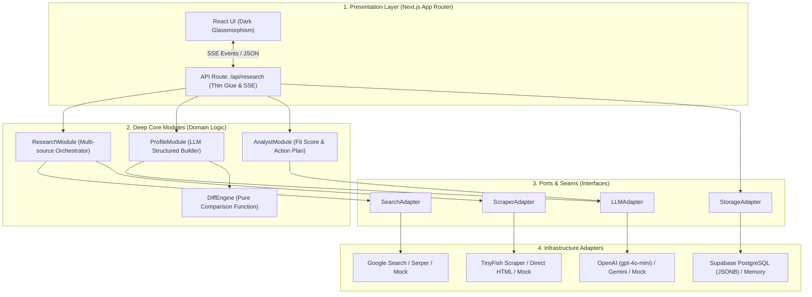
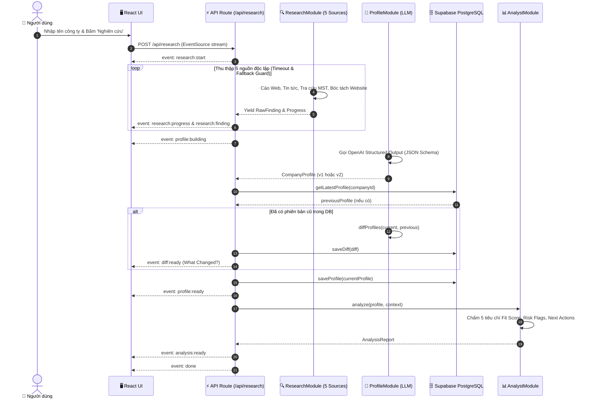
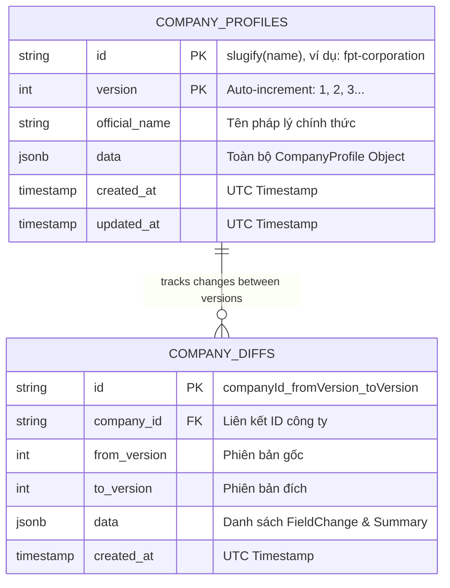
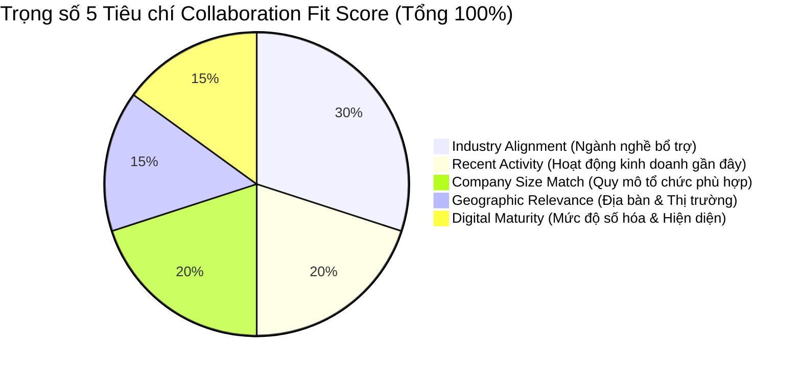

# PartnerIQ (TechBridgeAI) 🚀

> **AI-Powered Corporate Intelligence & Collaboration Intelligence Platform**  
> Tự động thu thập dữ liệu đa nguồn, tổng hợp hồ sơ doanh nghiệp đa phiên bản, đánh giá điểm phù hợp hợp tác (Collaboration Fit Score) và theo dõi biến động lịch sử tự động.

[](https://github.com/devonxjz/TechBridgeAI/actions/workflows/ci.yml)
[](https://opensource.org/licenses/MIT)
[-black)](https://nextjs.org/)
[](https://supabase.com)

---

## 🌟 Tính Năng Nổi Bật

* **Multi-source Research Pipeline:** Tự động tổng hợp thông tin từ 5 nguồn độc lập:
  * 🌐 Web Search (Google / Serper / Mock)
  * 📄 Website Scraping (TinyFish / Direct HTML extraction)
  * 📰 Tin tức kinh doanh & Báo chí (CafeF, Báo Đầu tư, VnExpress...)
  * 🏛️ Cổng thông tin Đăng ký Kinh doanh & Mã số thuế
  * 💼 Hồ sơ chuyên gia & Nhân sự chủ chốt
* **Real-time SSE Streaming:** Trực quan hóa tiến trình thu thập và phân tích dữ liệu dạng timeline real-time.
* **OpenAI Structured Profile Builder:** Tự động chuẩn hóa và trích xuất cấu trúc hồ sơ doanh nghiệp (`CompanyProfile`) với độ tin cậy và nguồn trích dẫn rõ ràng.
* **Analyst Module & Collaboration Fit Score:** Chấm điểm mức độ phù hợp hợp tác (0-100) theo 5 tiêu chí trọng số:
  * 🏢 *Industry Alignment (30%)*
  * 👥 *Company Size Match (20%)*
  * 📍 *Geographic Relevance (15%)*
  * 💻 *Digital Maturity (15%)*
  * 📈 *Recent Activity (20%)*
* **"What Changed?" Diff Engine:** So sánh tự động giữa các lần cập nhật hồ sơ, phát hiện biến động về nhân sự, ngành nghề, sản phẩm.
* **Supabase PostgreSQL Multi-Versioning:** Lưu trữ JSONB đa phiên bản với tốc độ cao và chi phí tối ưu (Free tier).
* **Báo cáo chuyên nghiệp:** Hỗ trợ Copy Markdown, Tải file `.md` và xuất dữ liệu dạng JSON.

---

## 🏗️ Kiến Trúc Hệ Thống & Sơ Đồ Kỹ Thuật (Architecture Diagrams)

### 1. Kiến Trúc Phân Lớp (Hexagonal / Ports & Adapters Architecture)



---

### 2. Luồng Xử Lý Dữ Liệu Thời Gian Thực (Data Flow & Streaming Lifecycle)



---

### 3. Mô Hình Lưu Trữ Đa Phiên Bản (Supabase JSONB Entity Diagram)



---

### 4. Khung Đánh Giá Điểm Phù Hợp Hợp Tác (Collaboration Fit Score Model)



| Tiêu chí | Trọng số | Định nghĩa đánh giá |
| :--- | :---: | :--- |
| **Industry Alignment** | **30%** | Ngành kinh doanh của đối tác có liên quan hoặc tạo giá trị cộng hưởng trực tiếp. |
| **Recent Activity** | **20%** | Các hoạt động ra mắt sản phẩm, mở rộng thị trường, gọi vốn hoặc ký kết gần đây. |
| **Company Size Match** | **20%** | Quy mô nhân sự và thị phần có cân xứng với năng lực hợp tác. |
| **Geographic Relevance** | **15%** | Mức độ bao phủ thị trường (Việt Nam, Khu vực Đông Nam Á, Toàn cầu). |
| **Digital Maturity** | **15%** | Mức độ ứng dụng công nghệ, chất lượng website, kênh truyền thông số. |

---

## 🚀 Cài Đặt & Chạy Cục Bộ

### 1. Clone repository
```bash
git clone https://github.com/devonxjz/TechBridgeAI.git
cd TechBridgeAI
```

### 2. Cài đặt dependencies
```bash
npm install
```

### 3. Cấu hình file môi trường
Tạo file `.env.local` từ mẫu `.env.example`:
```bash
cp .env.example .env.local
```

Điền các thông số API:
```env
# LLM
LLM_PROVIDER=openai
OPENAI_API_KEY=sk-...

# Search
SEARCH_PROVIDER=mock      # mock | serper

# Scraper
SCRAPER_PROVIDER=tinyfish # tinyfish | mock
TINYFISH_API_KEY=sk-tinyfish-...

# Storage Provider — Supabase PostgreSQL
STORAGE_PROVIDER=supabase
SUPABASE_URL=https://your-project.supabase.co
SUPABASE_ANON_KEY=your-anon-key
```

### 4. Khởi tạo Cơ sở dữ liệu Supabase
Chạy đoạn mã SQL trong file [`supabase/schema.sql`](supabase/schema.sql) tại **SQL Editor** trên Supabase Dashboard.

### 5. Khởi chạy Development Server
```bash
npm run dev
```
Truy cập [http://localhost:3000](http://localhost:3000) trên trình duyệt.

---

## 🧪 Kiểm Thử (Testing)

Chạy bộ kiểm thử tự động với Vitest (10 test suites, 39 tests Unit, Integration & E2E):
```bash
npm test
```

Kiểm tra định kiểu TypeScript:
```bash
npx tsc --noEmit
```

Build production:
```bash
npm run build
```

---

## 📄 License
Dự án được phân phối dưới giấy phép [MIT](LICENSE).
