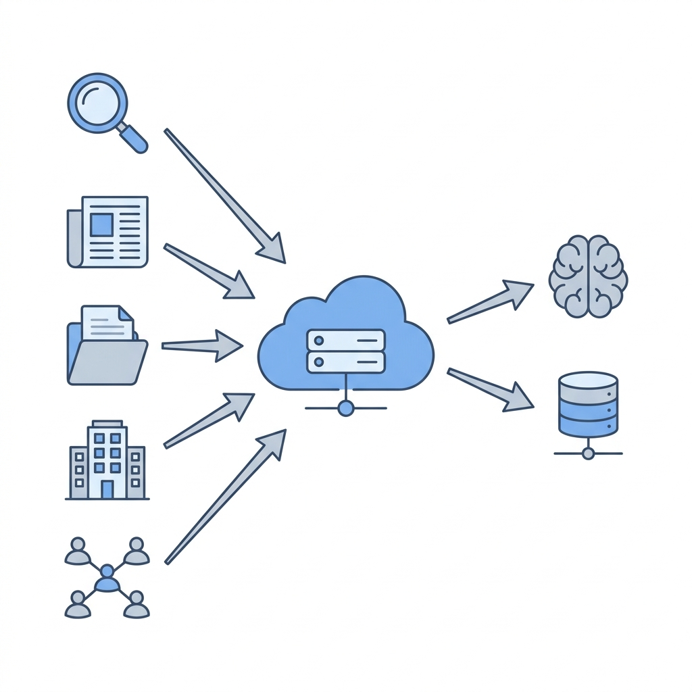

# PartnerIQ (TechBridgeAI) 🚀

> **AI-Powered Corporate Intelligence & Collaboration Fit Platform**  
> Nền tảng thẩm định doanh nghiệp thông minh: Tự động thu thập dữ liệu đa nguồn từ Internet, chuẩn hóa hồ sơ 360° qua LLM, chấm điểm tiềm năng hợp tác kinh doanh (Fit Score), nhận diện biến động theo thời gian và xuất báo cáo chuyên nghiệp.

[](https://github.com/devonxjz/TechBridgeAI/actions/workflows/ci.yml)
[](https://vitest.dev/)
[](https://nextjs.org/)
[](https://workers.cloudflare.com/)
[](https://openai.com/)
[](https://supabase.com)
[](https://langfuse.com/)
[](https://opensource.org/licenses/MIT)

---

## 🖼️ Kiến Trúc Hệ Thống (System Architecture)

Dưới đây là mô hình kiến trúc tổng thể của hệ thống PartnerIQ, được điều phối bởi **Cloudflare Workers (Research Gateway)** nhằm tự động hóa quá trình thu thập và xử lý dữ liệu doanh nghiệp thời gian thực.

<div align="center">
  
  <p><em>Kiến trúc tổng thể hệ sinh thái PartnerIQ — Quy trình thu thập đa nguồn, điều phối qua Cloudflare Workers, xử lý AI, lưu trữ Supabase và xuất bản báo cáo.</em></p>
</div>

---

## 💡 PartnerIQ Là Gì? (Dành Cho Người Mới Bắt Đầu)

Khi bạn muốn hợp tác với một đối tác hoặc doanh nghiệp mới, bạn thường mất hàng giờ tìm kiếm thông tin trên Google, tra cứu mã số thuế, đọc tin tức và phân tích rủi ro. **PartnerIQ tự động hóa toàn bộ quy trình này chỉ trong 3 bước đơn giản:**

1. **📥 Bước 1 — Nhập thông tin**: Nhập tên công ty, mã số thuế (MST) hoặc website doanh nghiệp.
2. **🧠 Bước 2 — AI tự động thu thập & phân tích**: Quét 5 nguồn dữ liệu độc lập, lọc bằng chứng, kiểm tra cache Supabase và tổng hợp hồ sơ qua mô hình LLM.
3. **📊 Bước 3 — Nhận báo cáo toàn diện**: Xem hồ sơ 360° có dẫn chứng nguồn gốc, điểm tiềm năng hợp tác (Fit Score 0–100) và xuất báo cáo định dạng chuyên nghiệp.

---

## 🌟 5 Nguồn Dữ Liệu Hoạt Động Như Thế Nào?

Hệ thống Research Gateway (Cloudflare Worker) thực thi việc thu thập thông tin qua 5 luồng song song:

1. **🔍 Tìm kiếm web (`web_search`):** Sử dụng công cụ Search API để tìm kiếm các bài viết, hồ sơ doanh nghiệp mới nhất trên Internet.
2. **🌐 Website công ty (`website`):** Trích xuất nội dung trang chủ và các trang giới thiệu (`/about`, `/products`), tự động phân tích qua các công cụ cào dữ liệu an toàn.
3. **📰 Tin tức truyền thông (`news`):** Quét các trang báo chí tài chính để phát hiện sự kiện nổi bật và dấu hiệu rủi ro.
4. **🏛️ Đăng ký kinh doanh (`registry`):** Tra cứu dữ liệu định danh pháp lý chính thức qua Mã số thuế.
5. **💼 Mạng lưới nhân sự (`linkedin`):** Khám phá cấu trúc lãnh đạo, nhân sự cốt cán và quy mô đội ngũ.

---

## 📊 Tiêu Chí Đánh Giá Điểm Hợp Tác (Collaboration Fit Score 0–100)

Hệ thống chấm điểm doanh nghiệp dựa trên **5 tiêu chí chuẩn hóa**:

* 🏢 **Phù hợp ngành nghề (Industry Alignment - 30%):** Đánh giá sự tương đồng trong lĩnh vực hoạt động.
* 👥 **Tương thích quy mô (Company Size Match - 20%):** Đánh giá năng lực tiếp nhận và quy mô nhân sự.
* 📍 **Vị trí địa lý (Geographic Relevance - 15%):** Khả năng triển khai thuận lợi theo vùng miền.
* 💻 **Mức độ số hóa (Digital Maturity - 15%):** Đánh giá mức độ ứng dụng công nghệ và hiện diện trực tuyến.
* 📈 **Hoạt động gần đây (Recent Activity - 20%):** Các dự án mới, sự kiện mở rộng hoặc phát triển trong 6–12 tháng qua.

> **Tính năng Bằng chứng thực tế (Real-world Evidence):** Mọi kết luận từ AI đều đi kèm link dẫn chứng gốc từ các nguồn thu thập!

---

## 🚀 Hướng Dẫn Cài Đặt & Chạy Nhanh (Quick Start)

### 1. Yêu cầu hệ thống
* **Node.js**: Phiên bản `>= 18.17.0` (khuyến nghị Node 20 LTS hoặc Node 24).
* **NPM / PNPM**.

### 2. Cài đặt các gói phụ thuộc
```bash
git clone https://github.com/devonxjz/TechBridgeAI.git
cd TechBridgeAI
npm install
```

### 3. Cấu hình biến môi trường
Tạo file `.env.local` từ file mẫu:
```bash
cp .env.example .env.local
```

Điền các khóa API cơ bản:
```dotenv
# LLM Provider
LLM_PROVIDER=openai
OPENAI_API_KEY=sk-...

# Search Provider
SEARCH_PROVIDER=serper
SERPER_API_KEY=...

# Storage (Supabase hoặc Memory)
STORAGE_PROVIDER=supabase
SUPABASE_URL=https://your-project.supabase.co
SUPABASE_ANON_KEY=eyJ...
SUPABASE_SERVICE_ROLE_KEY=eyJ...

# Langfuse Observability (Tùy chọn)
LANGFUSE_ENABLED=true
LANGFUSE_PUBLIC_KEY=pk-...
LANGFUSE_SECRET_KEY=sk-...
LANGFUSE_BASE_URL=https://cloud.langfuse.com
```

### 4. Khởi chạy ứng dụng
```bash
npm run dev
```
Truy cập [http://localhost:3000](http://localhost:3000) trên trình duyệt để sử dụng.

### 5. Kiểm thử hệ thống
```bash
npm run test        # Chạy toàn bộ 27 test suites với Vitest
npm run lint        # Kiểm tra chuẩn mã nguồn ESLint
npm run typecheck   # Kiểm tra kiểu TypeScript
npm run build       # Biên dịch production build với Turbopack
```

---

## 📄 Giấy Phép & Bản Quyền (License)

Dự án được phân phối dưới giấy phép **[MIT License](LICENSE)**.  
Phát triển bởi đội ngũ **PartnerIQ / TechBridgeAI**.
