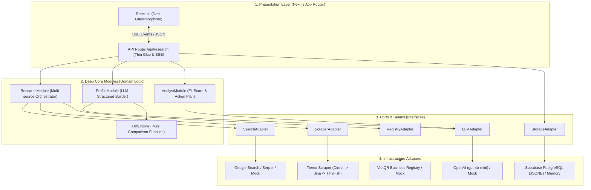

# PartnerIQ (TechBridgeAI) 🚀

> **AI-Powered Corporate Intelligence & Collaboration Intelligence Platform**  
> Tự động thu thập dữ liệu đa nguồn, tổng hợp hồ sơ doanh nghiệp đa phiên bản, đánh giá điểm phù hợp hợp tác (Collaboration Fit Score) và theo dõi biến động lịch sử tự động.

[](https://github.com/devonxjz/TechBridgeAI/actions/workflows/ci.yml)
[](https://opensource.org/licenses/MIT)
[-black)](https://nextjs.org/)
[](https://www.typescriptlang.org/)
[](https://supabase.com)

---

## 🌟 Tính Năng Nổi Bật

* **Multi-source Research Pipeline:** Tự động tổng hợp thông tin từ 5 nguồn độc lập:
  * 🌐 **Web Search:** Google Serper API / Mock search.
  * 📄 **Tiered Website Scraper:** Chuỗi fallback 3 cấp `SafeDirect → Jina Reader → TinyFish` với SSRF protection, DNS pinning, stream limit và không tạo evidence giả.
  * 📰 **Tin tức kinh doanh:** CafeF, Báo Đầu tư, VnExpress...
  * 🏛️ **Business Registry:** Tích hợp trực tiếp **VietQR Business API** qua `taxId` với fallback sang tra cứu aggregator / search.
  * 💼 **Hồ sơ chuyên gia & LinkedIn:** Bóc tách dữ liệu nhân sự chủ chốt.
* **Real-time SSE Streaming:** Trực quan hóa tiến trình thu thập và phân tích dữ liệu dạng timeline real-time.
* **OpenAI Structured Profile Builder:** Tự động chuẩn hóa và trích xuất cấu trúc hồ sơ doanh nghiệp (`CompanyProfile`) với độ tin cậy và nguồn trích dẫn rõ ràng.
* **Analyst Module & Collaboration Fit Score:** Chấm điểm mức độ phù hợp hợp tác (0-100) theo 5 tiêu chí trọng số:
  * 🏢 *Industry Alignment (30%)*
  * 👥 *Company Size Match (20%)*
  * 📍 *Geographic Relevance (15%)*
  * 💻 *Digital Maturity (15%)*
  * 📈 *Recent Activity (20%)*
* **"What Changed?" Diff Engine:** So sánh tự động giữa các lần cập nhật hồ sơ, phát hiện biến động về nhân sự, ngành nghề, sản phẩm.
* **Supabase PostgreSQL Multi-Versioning:** Lưu trữ JSONB đa phiên bản với tốc độ cao và chi phí tối ưu (Free tier).
* **Báo cáo & Xuất bản chuyên nghiệp:**
  * 📋 **Copy Markdown & Tải .md / .json**: Tải báo cáo chi tiết dạng markdown hoặc dữ liệu thô.
  * 📑 **Xuất PDF One-Pager (A4 Portrait)**: Tạo tài liệu tóm tắt 1 trang tiếng Việt chuyên nghiệp chuẩn doanh nghiệp với Fit Score, 5 thanh tiêu chí trực quan, Nhận định, Rủi ro, Hành động và Nguồn trích dẫn. Được tạo hoàn toàn phía client bằng `@react-pdf/renderer` qua dynamic import, hoạt động offline với font Noto Sans tiếng Việt.

---

## 🏗️ Kiến Trúc Hệ Thống (Architecture Diagrams)

### 1. Kiến Trúc Phân Lớp (Hexagonal / Ports & Adapters Architecture)



---

## 🚀 Cấu Hình & Biến Môi Trường (Configuration & Reliability)

### File `.env.local` mẫu

```dotenv
# LLM
LLM_PROVIDER=openai              # openai | mock
OPENAI_API_KEY=sk-...

# Search
SEARCH_PROVIDER=mock             # serper | mock
SERPER_API_KEY=...

# Scraper Provider (tiered | tinyfish | mock)
SCRAPER_PROVIDER=tiered
SCRAPER_DIRECT_ENABLED=true
SCRAPER_JINA_ENABLED=true
SCRAPER_TINYFISH_ENABLED=true
JINA_API_KEY=
TINYFISH_API_KEY=
SCRAPER_TIMEOUT_MS=8000
SCRAPER_MAX_RESPONSE_BYTES=1048576
SCRAPER_MAX_REDIRECTS=3
MAX_SCRAPE_PAGES_PER_RESEARCH=5

# Registry Provider (VietQR)
VIETQR_ENABLED=true

# Storage Provider
STORAGE_PROVIDER=supabase        # supabase | memory
SUPABASE_URL=https://xyz.supabase.co
SUPABASE_ANON_KEY=...

# Resource Guards
MAX_CONCURRENT_RESEARCH=1
SOURCE_TIMEOUT_MS=30000
MAX_RESEARCH_PER_DAY=50
MAX_TOKENS_PER_DAY=500000
```

### Cơ chế Missing-Key & Fallback Chain
- `SCRAPER_PROVIDER=tiered`: Tự động khởi tạo chuỗi `SafeDirect → Jina Reader → TinyFish`.
  - Nếu thiếu `JINA_API_KEY`, tier Jina tự động được bỏ qua mà không làm crash ứng dụng.
  - Nếu thiếu `TINYFISH_API_KEY`, tier TinyFish tự động được bỏ qua.
  - Luôn có `SafeDirect` bảo vệ với cơ chế SSRF Validation, DNS pinning và linear HTML cleaner.
- `VIETQR_ENABLED=true`: Khi input có `taxId`, hệ thống tự động tra cứu VietQR trước và cache kết quả trong bộ nhớ (7 ngày). Nếu lỗi/rate-limited hoặc không có `taxId`, hệ thống chuyển tiếp sang aggregator search hiện tại.

### Rollback không cần revert code

| Tình huống | Cấu hình Env | Chuỗi xử lý |
| :--- | :--- | :--- |
| Direct scraper gặp lỗi mạng / firewall | `SCRAPER_DIRECT_ENABLED=false` | Jina → TinyFish |
| Jina Reader 429 kéo dài | `SCRAPER_JINA_ENABLED=false` | Direct → TinyFish |
| TinyFish sự cố / tiết kiệm chi phí | `SCRAPER_TINYFISH_ENABLED=false` | Direct → Jina |
| Rollback toàn bộ về TinyFish độc lập | `SCRAPER_PROVIDER=tinyfish` | TinyFish-only |
| VietQR API sự cố | `VIETQR_ENABLED=false` | Aggregator / Search fallback |
| Môi trường thử nghiệm / Test offline | `SCRAPER_PROVIDER=mock` | Mock Scraper |

---

## 🧪 Kiểm Thử & Xác Thực (Testing & Verification)

Chạy bộ kiểm thử tự động với Vitest (16 test suites, bao gồm PDF One-Pager tests, Transport TLS, Unit, Integration & E2E):
```bash
npm test
```

Kiểm tra kiểu dữ liệu với TypeScript 7 và Next route types:
```bash
npm run typecheck
npm run typecheck:legacy
```

Kiểm tra mã nguồn với ESLint:
```bash
npm run lint
```

Build production bundle:
```bash
npm run build
```

---

## 📄 License
Dự án được phân phối dưới giấy phép [MIT](LICENSE).
