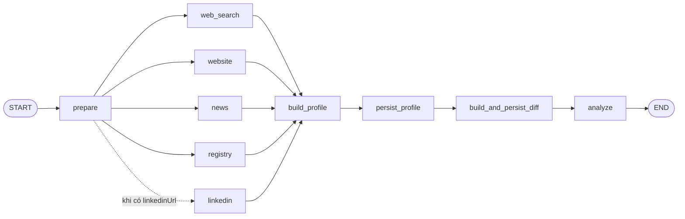

# LangGraph JS/TS cho orchestration nghiên cứu doanh nghiệp PartnerIQ

**Ngày kiểm chứng:** 2026-08-25  
**Phạm vi:** LangGraph JS/TS OSS và runtime/deployment chính thức của LangChain; không đánh giá framework thứ ba.  
**Phiên bản tham chiếu:** `@langchain/langgraph` **1.4.12**, phát hành ngày 2026-08-19; release này nâng checkpoint integration lên bản serializer đã vá. Vì vậy khi triển khai nên pin chính xác phiên bản và lockfile, không dùng range rộng. ([release chính thức](https://github.com/langchain-ai/langgraphjs/releases/tag/%40langchain%2Flanggraph%401.4.12))

## Kết luận

PartnerIQ phù hợp với `StateGraph`: bốn nguồn luôn chạy (`web_search`, `website`, `news`, `registry`) và `linkedin` chỉ chạy khi có URL có thể fan-out song song, gom kết quả bằng reducer, rồi fan-in trước các bước build profile → persist/diff → analyst. LangGraph chạy các nhánh cùng superstep đồng thời và node downstream chỉ chạy sau khi các nhánh upstream hoàn tất; state updates của nhánh song song phải có reducer. ([Graph API: parallel branches](https://docs.langchain.com/oss/javascript/langgraph/use-graph-api#create-branches))

Khuyến nghị pha đầu là **nhúng thư viện OSS trong Next.js Node route hiện tại**, giữ nguyên hợp đồng SSE và các adapter/domain module. Chưa cần LangSmith Deployment/Agent Server nếu một lần nghiên cứu vẫn hoàn tất trong vòng đời HTTP và chưa cần durable task queue, autoscaling hoặc run tiếp tục khi client rời đi. Agent Server là một deployment riêng có persistence và task queue; nó không phải là một tính năng tự xuất hiện khi cài package OSS. ([so sánh LangGraph OSS và LangSmith](https://docs.langchain.com/langsmith/faq#how-are-langgraph-and-langsmith-different), [Agent Server](https://docs.langchain.com/langsmith/agent-server))

## Bối cảnh PartnerIQ hiện tại

- [`src/modules/research/index.ts`](../../src/modules/research/index.ts) gọi tối đa năm nguồn **tuần tự** trong `AsyncGenerator`, bao mỗi nguồn bằng `Promise.race` timeout và chuyển lỗi thành `SourceResult` để các nguồn sau vẫn chạy.
- [`src/app/api/research/route.ts`](../../src/app/api/research/route.ts) giữ orchestration cấp cao trong một background IIFE: research → profile → save → diff → analyst, đồng thời chuyển `ResearchEvent` thành SSE.
- [`src/lib/types.ts`](../../src/lib/types.ts) đã có state domain cần thiết: `CompanyInput`, `RawFinding`, `SourceResult`, `CompanyProfile`, `ProfileDiff`, `AnalysisReport` và hợp đồng `StreamEvent`.
- [`package.json`](../../package.json) đang dùng Next.js `16.3.2`, Zod `4.4.3`, Node types 20 và chưa có LangGraph/LangChain dependency.

Mục tiêu nâng cấp nên là thay orchestration tuần tự và background IIFE dễ mất việc bằng graph có state/step rõ ràng, không viết lại source adapters, profile builder, analyst hoặc storage.

## Graph đề xuất

`StateGraph` dùng `addNode`, `addEdge`, `START`/`END` và compile-time graph checks; node là hàm TypeScript nhận state hiện tại và trả về partial state update. `StateSchema` hiện là API state chính, hỗ trợ Zod và `ReducedValue` cho reducer. ([StateGraph, node và edge](https://docs.langchain.com/oss/javascript/langgraph/use-graph-api#create-a-sequence-of-steps), [state/reducer](https://docs.langchain.com/oss/javascript/langgraph/use-graph-api#define-and-update-state))

### State tối thiểu

| Key | Cách cập nhật | Lý do |
|---|---|---|
| `input` | overwrite một lần | `CompanyInput` đã validate ở route |
| `sourceResults` | `ReducedValue` nối mảng | mỗi nhánh ghi đúng một success/failure result |
| `findings` | `ReducedValue` nối mảng | fan-in toàn bộ `RawFinding` |
| `existingProfile` | overwrite | đọc một lần trước build profile |
| `profile`, `diff`, `report` | overwrite theo node | output tuần tự sau fan-in |
| `fatalError` | overwrite | lỗi khiến cả workflow dừng |

Các nhánh song song không bảo đảm thứ tự update. Vì vậy reducer chỉ nên gom dữ liệu; `build_profile` phải sắp xếp deterministically theo thứ tự source cố định rồi URL/khóa ổn định trước khi gọi LLM hoặc tạo diff. ([cảnh báo thứ tự update song song](https://docs.langchain.com/oss/javascript/langgraph/use-graph-api#run-graph-nodes-in-parallel))

### Edge tĩnh hay `Send`

**Chọn edge tĩnh + conditional edge ở hiện trạng.** Danh sách nguồn chỉ có bốn mục bắt buộc và một mục tùy chọn, nên router có thể trả về bốn hoặc năm node name. LangGraph cho phép conditional edge trả về nhiều destination để fan-out. ([conditional branching](https://docs.langchain.com/oss/javascript/langgraph/use-graph-api#conditional-branching))

`Send` là API map-reduce phù hợp khi số nhánh chỉ biết tại runtime, ví dụ nguồn được lấy từ cấu hình, mỗi công ty sinh N truy vấn, hoặc mỗi finding sinh một tác vụ enrichment. Router khi đó trả `new Send("researchSource", { source, input })` cho từng item và reducer gom kết quả. ([Send API](https://docs.langchain.com/oss/javascript/langgraph/use-graph-api#map-reduce-and-the-send-api))

Không dùng `Send` ngay chỉ để thay năm edge: nó thêm state input riêng cho worker và dispatcher/switch mà chưa đem lại lợi ích. Ngoài ra còn có issue chính thức đang mở: với `@langchain/langgraph` 1.4.8, `Send` + `maxConcurrency: 1` có thể âm thầm bỏ task; issue vẫn mở tại ngày kiểm chứng. Nếu dùng `Send`, cần regression test đếm `dispatched === completed` và không cấu hình concurrency bằng 1 cho đến khi xác nhận bản đang pin đã sửa. ([issue #2656](https://github.com/langchain-ai/langgraphjs/issues/2656))

## Persistence và checkpointing

Khi compile với checkpointer, LangGraph lưu graph state thành checkpoint theo thread ở biên mỗi superstep. Điều này cho phép resume, fault recovery, time travel và human-in-the-loop; invocation phải có `configurable.thread_id`. ([persistence](https://docs.langchain.com/oss/javascript/langgraph/persistence))

Áp dụng cho PartnerIQ:

1. Tạo một `thread_id` **duy nhất cho mỗi research attempt**; không dùng `companyId` đơn lẻ vì hai lần nghiên cứu đồng thời cùng công ty sẽ đè/chia sẻ state.
2. Dùng `MemorySaver` chỉ cho test/local. Production dùng durable checkpointer như `PostgresSaver` hoặc MongoDB; Postgres integration yêu cầu chạy `setup()` như một migration/deployment step. ([production checkpointer](https://docs.langchain.com/oss/javascript/langgraph/add-memory#use-in-production))
3. Giữ checkpoint storage tách về schema/retention policy khỏi bảng hồ sơ công ty. Checkpoint có thể chứa toàn bộ nội dung scrape và dữ liệu cá nhân; cần access control, encryption và TTL/pruning theo chính sách dữ liệu.
4. `persist_profile` và `build_and_persist_diff` phải idempotent vì replay/resume có thể chạy lại node. Supabase adapter hiện đã `upsert` theo `(id, version)` và diff ID ổn định; memory adapter không durable nên không dùng làm production recovery.
5. Tránh đưa class instance/function/adapter vào state. State và interrupt payload nên là dữ liệu serialize được; với các trường `Date`, ưu tiên ISO string trong checkpoint rồi hydrate tại domain boundary. Interrupt docs yêu cầu payload JSON-serializable. ([serialization của interrupt](https://docs.langchain.com/oss/javascript/langgraph/interrupts#do-not-return-complex-values-in-interrupt-calls))

Checkpointing trong OSS là **tự quản lý**. Nếu dùng Agent Server, server tự cung cấp persistence/task queue và quản lý checkpoint; không cấu hình checkpointer trong graph như embedded OSS. ([Agent Server persistence](https://docs.langchain.com/langsmith/agent-server#parts-of-a-deployment))

## Interrupt và resume

Không thêm approval interrupt trong pha đầu vì workflow hiện tại không yêu cầu con người duyệt. Nếu sau này cần duyệt profile trước khi ghi, đặt một node `review_profile` **giữa** `build_profile` và `persist_profile`:

- `interrupt(payload)` pause graph, checkpoint state và trả yêu cầu ra caller.
- Resume bằng `new Command({ resume: decision })` với cùng `thread_id`.
- Node chứa `interrupt` chạy lại từ đầu khi resume; mọi side effect trước interrupt phải idempotent hoặc chuyển sang node sau interrupt. Không bọc `interrupt` bằng `try/catch`. ([interrupt/resume](https://docs.langchain.com/oss/javascript/langgraph/interrupts), [quy tắc side effect](https://docs.langchain.com/oss/javascript/langgraph/interrupts#side-effects-called-before-interrupt-must-be-idempotent))

Graph state/schema và node name của các thread đang dở là một compatibility contract. LangGraph chạy code graph mới nhất khi thread cũ resume, không pin thread vào version code cũ; đổi tên node, xóa state key hoặc đổi reducer có thể làm thread cũ hỏng. Cần version hóa graph hoặc drain/migrate các thread đang chạy trước breaking change. ([backward compatibility](https://docs.langchain.com/oss/javascript/langgraph/backward-compatibility))

## Streaming và SSE

Giữ hợp đồng SSE hiện tại và đổi producer thành graph stream:

- `streamMode: "custom"` cho các event domain hiện có như `research:start`, source `started/done/failed`, `profile:building`.
- `streamMode: "updates"` nếu cần quan sát node/state update; không gửi full `values` chứa raw scrape ra browser.
- Node phát progress qua stream writer; route map chunk về `StreamEvent` hiện có rồi ghi vào `createSSEStream`.

LangGraph `graph.stream()` trả async iterator và hỗ trợ `values`, `updates`, `messages`, `custom`, `tools`, `debug`; `custom` được phát từ node qua writer. ([streaming modes và custom writer](https://docs.langchain.com/oss/javascript/langgraph/streaming))

`streamEvents(..., { version: "v3" })` cung cấp typed projections đồng thời (`messages`, `values`, `interrupts`, `output`, subgraphs) và phù hợp khi UI cần token/HITL/subgraph phức tạp. Với SSE progress cố định của PartnerIQ, low-level `stream()` + `custom` là ít code hơn; chỉ chuyển sang Event Streaming khi UI thực sự cần các projection đó. ([Event Streaming](https://docs.langchain.com/oss/javascript/langgraph/event-streaming))

Streaming OSS chỉ là in-process API; nó không tự tạo HTTP endpoint. Agent Server mới cung cấp HTTP/SSE API, threads/runs và client SDK. ([phân biệt HTTP API](https://docs.langchain.com/langsmith/faq#how-are-langgraph-and-langsmith-different))

## Retry, timeout, cancellation và concurrency

### Retry và partial success

Retries trong JS là opt-in: gắn `retryPolicy` cho node hoặc graph defaults. `retryPolicy` nên chỉ retry lỗi transient như timeout, 429/5xx/network reset; không retry validation, blocked source hoặc empty result. Từ `@langchain/langgraph>=1.4.0`, `errorHandler` chạy sau khi retry cạn và có thể update state/route bằng `Command`. ([fault tolerance: retries/error handlers](https://docs.langchain.com/oss/javascript/langgraph/fault-tolerance))

PartnerIQ cần giữ semantics hiện tại: một source thất bại không làm mất findings từ source khác. Nếu exception thoát khỏi một nhánh song song, superstep lỗi và state updates của cả superstep chưa được apply; với checkpointer, pending writes từ nhánh thành công được lưu và không cần chạy lại khi resume. Vì vậy mỗi source node nên có retry + error handler chuyển lỗi cuối cùng thành `sourceResults` failure, chỉ phát `fatalError` khi **tất cả** nguồn thất bại hoặc bước profile/persist không thể tiếp tục. ([parallel exception semantics](https://docs.langchain.com/oss/javascript/langgraph/use-graph-api#run-graph-nodes-in-parallel), [pending writes](https://docs.langchain.com/oss/javascript/langgraph/persistence))

Retry có thể lặp lại paid API call. Chỉ retry operation idempotent, ghi attempt metadata và đặt tổng budget; `runtime.executionInfo.nodeAttempt` cho biết attempt hiện tại. ([execution info](https://docs.langchain.com/oss/javascript/langgraph/use-graph-api#access-execution-info-inside-a-node))

### Timeout

Từ `@langchain/langgraph>=1.4.0`, `addNode(..., { timeout })` hỗ trợ millisecond wall-clock timeout hoặc `{ runTimeout, idleTimeout }`; timeout tạo `NodeTimeoutError`, xóa writes của attempt lỗi và có thể đi qua retry policy. Đây là thay thế trực tiếp, rõ hơn cho `Promise.race` hiện tại. ([per-node timeout](https://docs.langchain.com/oss/javascript/langgraph/fault-tolerance#timeouts))

Giữ timeout khác nhau theo source vì scrape website/registry có đặc tính khác web search; không dùng một magic timeout cho mọi node. Ngoài per-node timeout, `RunnableConfig` có `timeout` cho toàn run và `signal: AbortSignal` để abort invocation. ([RunnableConfig](https://reference.langchain.com/javascript/langchain-core/runnables/RunnableConfig))

### Cancellation và shutdown

- Embedded Next route: truyền request abort signal vào graph config; các adapter/fetch bên dưới cũng phải nhận và truyền signal, nếu không chỉ graph caller dừng chờ còn I/O vẫn chạy.
- `RunControl.requestDrain()` (>=1.4.0) dừng sạch ở biên superstep và cho phép resume từ checkpoint, nhưng không cancel async work đang chạy; cần kết hợp timeout/`AbortSignal` cho hard bound. ([graceful shutdown](https://docs.langchain.com/oss/javascript/langgraph/fault-tolerance#graceful-shutdown))
- Agent Server có API cancel riêng và hỗ trợ cancel-on-disconnect; đây là khả năng Platform, không phải embedded OSS. ([cancel Agent Server run](https://docs.langchain.com/langsmith/cancel-run))

### Concurrency control

`RunnableConfig.maxConcurrency` là giới hạn số parallel calls. Trong JavaScript option đúng là **camelCase và top-level**, ví dụ `{ maxConcurrency: n }`, không phải `configurable.max_concurrency`; dựa vào TypeScript type/reference của `@langchain/core` khi docs snippet khác biệt. ([JS RunnableConfig](https://reference.langchain.com/javascript/langchain-core/runnables/RunnableConfig/maxConcurrency))

Không chọn một con số cố định nếu chưa có quota của search/scraper/registry provider. Cấu hình cap theo quota thấp nhất và connection pool, cộng thêm semaphore riêng nếu nhiều request HTTP cùng chạy vì `maxConcurrency` chỉ giới hạn trong một graph invocation. Với `Send`, tránh `maxConcurrency: 1` cho tới khi issue #2656 được đóng và regression test của PartnerIQ chạy qua bản đã pin.

## Tương thích Next.js server route

### Embedded OSS trong Next.js

Phương án khả thi ở **Node.js runtime** vì LangGraph JS là package ESM/TypeScript được gọi qua `invoke`/`stream`, còn route hiện đã trả Web `Response`/SSE. Official docs hướng dẫn cài `@langchain/langgraph` cùng `@langchain/core`; không cần cài package `langchain` cấp cao nếu PartnerIQ tiếp tục dùng adapter OpenAI riêng. ([cài đặt LangGraph JS](https://docs.langchain.com/oss/javascript/langgraph/install))

Các điều kiện cần xác minh trong spike trước khi merge:

1. Ép route về Node runtime; không giả định Edge runtime tương thích vì docs LangGraph không cam kết Next Edge và Postgres/checkpoint drivers có thể cần Node APIs.
2. Build/typecheck với Next `16.3.2`, Zod `4.4.3` và TypeScript 6/7 experimental hiện tại.
3. Compile graph ở module/factory phù hợp và không giữ durable state trong process memory. Serverless instance có thể cold start/recycle; `MemorySaver` sẽ mất checkpoint.
4. Không chạy workflow bằng IIFE tách khỏi response. Khi embedded, consume graph stream cho tới complete/abort trong lifetime của SSE response.
5. Kiểm tra execution limit của hosting target; nếu research có thể dài hơn request limit hoặc cần tiếp tục sau disconnect, chuyển execution sang Agent Server/durable worker thay vì cố kéo dài route.

Hai điểm cuối là rủi ro deployment của PartnerIQ, không phải guarantee của LangGraph OSS. Chính docs LangChain cảnh báo standalone Agent Server không được chạy trong serverless/scale-to-zero vì có thể mất task; Agent Server cần container/VM/Kubernetes với PostgreSQL và Redis. ([self-hosted/standalone server](https://docs.langchain.com/langsmith/self-hosted#standalone-server))

### Khi nào dùng LangSmith Deployment / Agent Server

Tách Agent Server thành service riêng và để Next.js làm UI/BFF khi cần một trong các điều sau:

- run tiếp tục độc lập với HTTP connection;
- durable queue, retry/recovery đa instance;
- thread/run/assistant HTTP APIs, cron jobs, cancel/join stream;
- autoscaling worker và giới hạn một run đồng thời trên mỗi thread;
- Studio/managed persistence/deployment operations.

Agent Server load compiled graph một lần, ghi checkpoint vào persistence layer, chạy task qua queue worker và phát event SSE qua pub/sub. ([Agent Server lifecycle](https://docs.langchain.com/langsmith/agent-server#runtime-architecture))

## OSS và “LangGraph Platform” không phải một thứ

| Khía cạnh | `@langchain/langgraph` OSS | LangSmith Deployment / Agent Server (tên hiện hành của lớp Platform) |
|---|---|---|
| Vai trò | Thư viện orchestration nhúng trong process | Runtime/service triển khai graph |
| API HTTP | Không | Có: assistants, threads, runs, cron, streaming |
| Checkpoint | Tự chọn/tự vận hành checkpointer | Server quản lý; Postgres mặc định trong deployment |
| Queue/autoscale | Ứng dụng tự làm | Có task queue và nhiều runtime mode |
| Hosting | Next/Node/container do đội dự án quản lý | Cloud, hybrid, self-hosted hoặc standalone server |
| Chi phí/giấy phép | Package OSS; hạ tầng tự trả | Plan/license phụ thuộc deployment mode |

Official FAQ mô tả LangGraph là framework orchestration stateful, còn LangSmith là dịch vụ deploy/scale với HTTP API và managed persistence. ([official comparison](https://docs.langchain.com/langsmith/faq#how-are-langgraph-and-langsmith-different)) “LangGraph Platform” trong tài liệu/cấu hình cũ không nên được dùng để gọi package OSS; tài liệu hiện hành dùng **LangSmith Deployment** và **Agent Server**. ([LangSmith setup modes](https://docs.langchain.com/langsmith/platform-setup), [application structure](https://docs.langchain.com/langsmith/application-structure))

## Lộ trình triển khai đề xuất

1. **Spike embedded OSS:** pin `@langchain/langgraph@1.4.12` + compatible `@langchain/core`; dựng graph chỉ cho research fan-out/fan-in, giữ profile/storage/analyst phía sau để benchmark và xác nhận SSE/cancellation.
2. **Đưa toàn pipeline vào graph:** sau khi source parity đạt, thêm build profile → persist/diff → analyst; Postgres checkpointer và unique thread ID; kiểm thử crash/resume ở từng superstep.
3. **Chỉ thêm interrupt khi có yêu cầu approval thực tế.**
4. **Đánh giá Agent Server** nếu spike cho thấy request lifetime, multi-instance recovery hoặc queueing là yêu cầu bắt buộc.

Success criteria tối thiểu:

- 4/5 source được dispatch và completed đúng số lượng, kể cả một source timeout.
- Thời gian fan-out gần max latency của nhánh chậm nhất thay vì tổng latency tuần tự, trong quota cho phép.
- SSE giữ nguyên event contract hiện tại và đóng stream đúng một lần khi complete/error/abort.
- Resume cùng `thread_id` không gọi lại nhánh đã checkpoint thành công và không tạo profile/diff trùng.
- Output profile ổn định giữa nhiều run dù thứ tự hoàn tất của source thay đổi.

## Rủi ro cần chặn bằng test/operation

| Rủi ro | Tác động | Chặn |
|---|---|---|
| `Send` + `maxConcurrency: 1` issue đang mở | âm thầm thiếu source result | dùng static edges hiện tại; regression count; không cap 1 |
| Parallel update order không ổn định | prompt/diff thay đổi giữa run | reducer + sort deterministic trước profile |
| Retry lặp paid/non-idempotent call | tăng chi phí hoặc duplicate write | retryOn hẹp, attempt budget, idempotent upsert |
| Uncaught source exception làm fail superstep | mất partial-success UX | node retry + errorHandler thành typed failure |
| Checkpoint chứa raw scrape/PII | tăng blast radius dữ liệu | schema tách, encryption, RBAC, retention/pruning |
| Graph code đổi trong khi thread đang dở | resume lỗi/sai node | graph version, backward-compatible state/node names, drain/migrate |
| Next/serverless recycle hoặc disconnect | background IIFE mất việc | consume stream trong request; durable checkpointer; Agent Server khi cần |
| API docs và type khác naming | config concurrency không có hiệu lực | dùng TS types; camelCase top-level; integration test |
| Release nhanh, serializer vừa được vá ở 1.4.12 | regression/security drift | exact pin, lockfile, changelog review, dependency update cadence |

## Nguồn chính thức chính

- [LangGraph JS Graph API](https://docs.langchain.com/oss/javascript/langgraph/use-graph-api)
- [Persistence](https://docs.langchain.com/oss/javascript/langgraph/persistence)
- [Interrupts](https://docs.langchain.com/oss/javascript/langgraph/interrupts)
- [Streaming](https://docs.langchain.com/oss/javascript/langgraph/streaming)
- [Fault tolerance](https://docs.langchain.com/oss/javascript/langgraph/fault-tolerance)
- [Backward compatibility](https://docs.langchain.com/oss/javascript/langgraph/backward-compatibility)
- [LangGraph.js official repository/releases](https://github.com/langchain-ai/langgraphjs)
- [LangSmith Agent Server](https://docs.langchain.com/langsmith/agent-server)
