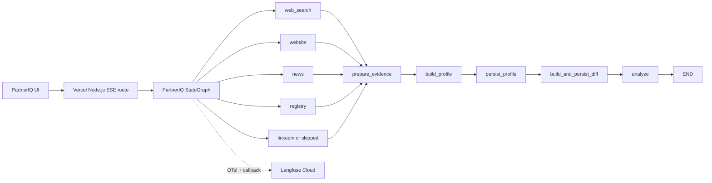

# PartnerIQ LangGraph and Langfuse Design

**Date:** 2026-08-25

**Status:** Approved direction; implementation pending

## Goal

Replace PartnerIQ's sequential company-research orchestration with a bounded,
parallel LangGraph workflow, use LangChain only at the model/tool contract
boundary, and send privacy-minimized workflow telemetry to Langfuse Cloud.

The workflow remains hosted in a Vercel Node.js Route Handler and is cancelled
when the client disconnects. It does not continue in a queue and does not resume
after the HTTP/SSE request ends.

## Current context

- `src/modules/research/index.ts` executes up to five source functions
  sequentially and exposes `AsyncGenerator<ResearchEvent>`.
- `src/app/api/research/route.ts` owns the outer sequence: collect findings,
  build profile, persist, diff, analyze, and write SSE events.
- `src/modules/research/sources/web-search.ts` already issues 2-4 bounded
  deterministic queries; `news.ts` issues two queries; `website.ts` reads up to
  five pages; `registry.ts` uses VietQR and bounded fallbacks.
- `src/modules/profile/index.ts` and `src/modules/analyst/index.ts` already own
  the Zod schemas and business prompts for structured output.
- `src/config/index.ts` declares call, token, timeout, and concurrency guards,
  but several are not enforced on the execution path.
- The UI consumes the current SSE contract and must not require a redesign.

## Architectural decisions

1. Use embedded `@langchain/langgraph` in the existing Vercel Node.js request.
2. Use a deterministic `StateGraph`; do not add a free-running ReAct agent.
3. Keep five static source nodes. LinkedIn returns `skipped` when no URL exists.
4. Do not use `Send` in the MVP. The current source/query set is small and
   bounded, and static nodes are easier to audit and regression-test.
5. Use LangChain only inside `LLMAdapter` for model abstraction,
   `withStructuredOutput`, retry/fallback ownership, and callbacks.
6. Use Langfuse Cloud through OpenTelemetry plus the LangChain/LangGraph
   callback. Do not double-instrument model calls.
7. Compile the MVP graph without a durable checkpointer. A unique
   `researchRunId` still correlates SSE, graph config, logs, and Langfuse.
8. Preserve partial success: one failed source must not discard successful
   findings from sibling branches.
9. Improve coverage first with a deterministic query matrix and measurable
   acceptance criteria. An LLM query planner is a later gated capability.

## System boundary



The Route Handler validates input, creates dependencies, starts one trace,
consumes graph custom events, maps them to the existing SSE union, and closes
the writer exactly once. Business orchestration moves out of the route.

## State contract

The graph state contains data, not adapter instances or callbacks:

```ts
type SourceExecutionStatus = "succeeded" | "failed" | "skipped";

interface SourceExecutionResult {
  source: SourceName;
  status: SourceExecutionStatus;
  findings: RawFinding[];
  error?: SourceError;
  attempts: number;
  durationMs: number;
}

interface ResearchWorkflowState {
  researchRunId: string;
  input: CompanyInput;
  sourceResults: SourceExecutionResult[];
  findings: RawFinding[];
  existingProfile: CompanyProfile | null;
  profile: CompanyProfile | null;
  diff: ProfileDiff | null;
  report: AnalysisReport | null;
  outcome: "running" | "complete" | "partial" | "failed";
  fatalError: string | null;
}
```

`sourceResults` and `findings` use append reducers because parallel nodes may
update them in any completion order. Downstream code never consumes reducer
order directly; `prepare_evidence` produces deterministic order first.

## Graph nodes and edges

### `prepare`

- Receives validated `CompanyInput` and `researchRunId`.
- Emits `research:start` with active sources.
- Does not call a provider.

### Source nodes

- `web_search`, `website`, `news`, `registry`, and `linkedin` call the existing
  source functions through existing adapters.
- Every node writes exactly one `SourceExecutionResult`.
- Each node emits `started` and then `done` or `failed`; skipped LinkedIn emits
  no UI progress event.
- A source exception is converted to typed failure after allowed retries. It
  does not escape and fail the whole parallel superstep.
- Timeout and cancellation signals must reach the underlying search/scraper
  request, not only the graph invocation.

### `prepare_evidence`

This is an evidence boundary, not a claim that arbitrary web text can be made
safe by stripping strings.

It performs:

1. Drop findings with invalid/non-HTTP(S) URLs or empty content.
2. Enforce the existing per-finding content ceiling.
3. Canonicalize URLs and deduplicate by canonical URL; keep the higher
   confidence duplicate.
4. Sort by source priority and then canonical URL.
5. Wrap scraped content as untrusted data before it enters an LLM prompt.
6. Calculate source coverage and determine `complete`, `partial`, or `failed`.

Source priority is field-sensitive:

| Fact class | Priority |
|---|---|
| Legal identity, tax ID, registered address | registry -> official website -> news -> aggregator/search snippet |
| Products, services, markets | official website -> registry -> trusted news -> search snippet |
| Recent activity and reputation risk | dated trusted news -> official announcement -> other web evidence |

Conflicting evidence is retained for the profile prompt with its source and
priority. The LLM must not silently treat a lower-priority source as canonical.

### `load_existing_profile`

- Reads the latest stored profile before creating the next version.
- Executes after evidence preparation and before profile generation.

### `build_profile`

- Reuses `ProfileModule` and its existing Zod schema.
- Receives only prepared evidence.
- Emits `profile:building` and `profile:ready`.
- A schema or model failure is fatal because persistence cannot continue.

### `persist_profile`

- Saves the generated profile once.
- No retry is performed unless the storage operation is demonstrably
  idempotent for `(profile.id, profile.version)`.

### `build_and_persist_diff`

- Produces and saves a diff when a previous profile exists.
- Emits `diff:ready` with the diff or `null`.

### `analyze`

- Reuses `AnalystModule` and its Zod schema.
- Analyst failure remains non-fatal, matching current behavior.
- Emits an error event, marks the workflow partial, and still completes.

## Coverage policy

"Cover the whole internet" is not a verifiable target. PartnerIQ instead uses
bounded coverage metrics:

- Required source dispatch count equals completed plus failed plus skipped.
- Unique canonical domains and URLs are recorded per run.
- `sourceCoverage = succeeded active sources / active sources`.
- Profile fields must be backed by at least one captured source before they are
  accepted as researched facts.
- News queries retain explicit recent/activity and English/Vietnamese angles.

The MVP keeps a deterministic query matrix with a hard cap:

```text
identity | products/services | leadership | recent activity | risk | tax/legal
```

Queries that do not apply are omitted. Existing `additionalKeywords` consume
the remaining cap instead of increasing it without limit. Query calls may run
concurrently inside their source node, but provider-specific concurrency is
bounded.

An LLM query planner is enabled only after an offline benchmark demonstrates
that the deterministic matrix misses the agreed field/citation threshold. If
enabled later, it must return structured queries, obey the same cap and budget,
and run behind a feature flag. `Send` is introduced only with that feature.

## Resource and failure policy

- One global run deadline is lower than the configured Vercel `maxDuration` so
  the graph can emit a terminal SSE event and flush Langfuse before termination.
- Each source has an explicit timeout and a provider concurrency limit.
- Retry only transient timeout, 429, 5xx, and network-reset failures.
- Authentication, invalid URL, blocked target, schema, and empty-result errors
  are not retried.
- Only one layer owns retries for a given call.
- Before every model call, enforce remaining call and token budgets.
- After every model call, reconcile actual usage into the run budget.
- Abort from the browser/request propagates to the graph and adapters; no
  terminal profile is persisted after cancellation.

Initial concurrency defaults are conservative calibration values, not API
guarantees: three source nodes per run and two calls per external provider.
They remain environment-configurable because provider quotas differ.

## LangChain boundary

`LLMAdapter` remains the application port. Its implementation uses
`@langchain/openai` and `@langchain/core`; callers do not receive LangChain
types.

- `completeStructured` uses the caller-owned Zod schema through
  `withStructuredOutput`.
- `complete` and `stream` map LangChain messages back to the existing adapter
  contract.
- Usage metadata maps into `LLMUsageLog` and the per-run budget.
- Model fallback is disabled until a second provider passes the same profile
  and analyst contract tests.
- The full `langchain` package and `createAgent` are not required.

## Langfuse Cloud design

One research request creates one trace:

```text
partneriq.research
└─ partneriq.workflow
   ├─ source.web_search
   ├─ source.website
   ├─ source.news
   ├─ source.registry
   ├─ source.linkedin
   ├─ profile.build
   │  └─ model generation
   ├─ profile.persist
   ├─ profile.diff
   └─ analyst.analyze
      └─ model generation
```

`src/instrumentation.ts` initializes the Node-only OTel exporter at Next.js
startup. A Langfuse callback is passed through the graph invocation, while
manual observations cover non-LangChain business/source/storage nodes.

Trace attributes:

- name: `partneriq.research`
- session: the research UI session ID when available
- metadata: `researchRunId`, internal `companyId`, requested sources, app version
- tags: `workflow:research`, `surface:sse`, environment

Do not export raw scraped HTML/text, authorization headers, cookies, API keys,
email, phone numbers, or the full input object. Apply client-side masking before
export and keep 100% sampling for the current demo-scale traffic.

Deterministic scores:

- `source_coverage`
- `profile_schema_valid`
- `profile_confidence`
- `analysis_schema_valid`
- `research_success` (`complete`, `partial`, or `failed`)

The processor flushes once after the root observation ends and before the SSE
workflow is considered complete. It is not shut down per request.

## Vercel and SSE behavior

- The route explicitly uses the Node.js runtime.
- `maxDuration` is configured in the route and must stay within the active
  Vercel plan.
- The internal run deadline reserves time for `done`/`error`, writer close, and
  Langfuse flush.
- The graph stream is consumed for the lifetime of the SSE response; no detached
  background queue is introduced.
- The writer closes exactly once on success, fatal error, or abort.
- Existing `StreamEvent` names and payloads remain compatible with the UI.

## Testing strategy

### Unit

- Reducers retain all parallel source results.
- Evidence deduplication and sorting are deterministic.
- Field-sensitive source precedence is encoded in the prepared prompt data.
- Budget guards reject a model call before exceeding its cap.
- Redaction removes configured sensitive values and keeps valid JSON.

### Integration

- Five source nodes fan out; LinkedIn skips without a URL.
- Completion order changes do not change prepared evidence order.
- One source timeout produces partial success and does not block siblings.
- Zero valid findings produces a failed outcome and no profile write.
- Cancellation reaches adapters and prevents persistence.

### E2E

- Existing SSE event contract still drives the UI.
- A successful run creates one profile, optional diff, and analysis.
- Partial source failure still completes with warning/error events.
- Langfuse is mocked at the export boundary; trace hierarchy and redaction are
  asserted without sending production telemetry.

## Acceptance criteria

1. Parallel source latency approaches the slowest active source rather than the
   sum of all active-source latencies, within configured concurrency.
2. Dispatched source count always equals succeeded plus failed plus skipped.
3. Reordered source completion produces the same evidence ordering and profile
   prompt.
4. One source failure preserves sibling findings; zero findings prevents profile
   persistence.
5. Existing SSE event names remain compatible and the writer closes once.
6. Client cancellation stops provider work and prevents terminal persistence.
7. One run produces one Langfuse trace with sibling source observations and
   nested model generations.
8. Telemetry contains no configured secrets, raw scraped pages, email, or phone.
9. Call/token/concurrency guards are enforced before spending, not only logged.
10. Test, lint, typecheck, and production build pass.

## Non-goals

- LangGraph Agent Server, durable queue, cron, or resume after disconnect.
- Human approval interrupts.
- Autonomous ReAct/tool-selection loops.
- `Send` or an LLM query planner before benchmark evidence.
- New search, scraping, vector-store, or storage providers.
- Langfuse self-hosting or prompt management in the first rollout.
- UI redesign or SSE protocol replacement.

## Source research

- [`docs/research/langgraph-orchestration.md`](../../research/langgraph-orchestration.md)
- [`docs/research/langchain-workflow-controls.md`](../../research/langchain-workflow-controls.md)
- [`docs/research/langfuse-observability.md`](../../research/langfuse-observability.md)
